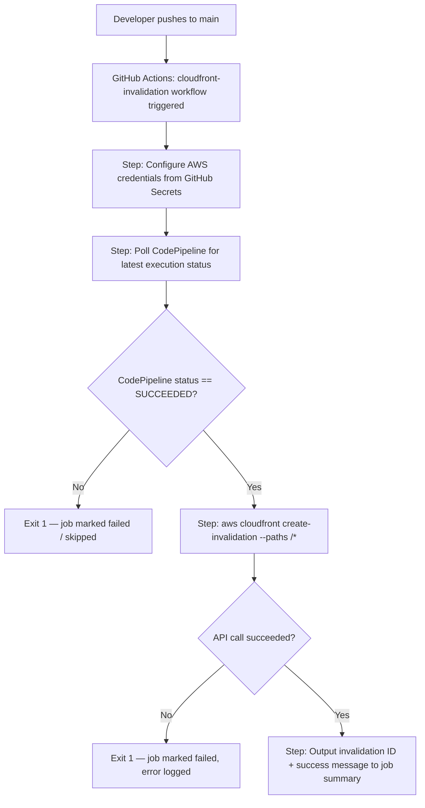

# Design Document: CloudFront Cache Invalidation

## Overview

This feature automates CloudFront cache invalidation for the AWS Community Pakistan website by adding a GitHub Actions workflow that runs after every successful AWS CodePipeline deployment on the main branch. The workflow polls CodePipeline for the latest execution status, and only when it confirms a successful deployment does it call `cloudfront:CreateInvalidation` with path `/*`. All credentials are read from GitHub Secrets; nothing is hard-coded in the workflow file.

The solution is intentionally minimal: a single YAML workflow file and a least-privilege IAM user provisioned once via the AWS CLI.

---

## Architecture



Key design decisions:

- **Polling instead of event subscription**: CodePipeline does not natively emit events to GitHub Actions. The simplest reliable approach is to call `aws codepipeline get-pipeline-state` immediately after the push and check the `latestExecution.status` of the deploy stage. No extra infrastructure (EventBridge, SNS, Lambda) is required.
- **Single workflow file**: All logic lives in `.github/workflows/cloudfront-invalidation.yml`. No reusable actions or composite actions are needed given the small scope.
- **Least-privilege IAM user**: A dedicated `cloudfront-invalidator` IAM user holds only `cloudfront:CreateInvalidation` scoped to the exact Distribution ARN. No roles, no OIDC (kept simple for this use case).

---

## Components and Interfaces

### 1. GitHub Actions Workflow (`cloudfront-invalidation.yml`)

Triggered on `push` to `main`. Contains a single job with these steps:

| Step | Tool / Command | Purpose |
|------|---------------|---------|
| Checkout | `actions/checkout@v4` | Required by some actions; also makes pipeline name available via repo metadata |
| Configure AWS credentials | `aws-actions/configure-aws-credentials@v4` | Injects `AWS_ACCESS_KEY_ID`, `AWS_SECRET_ACCESS_KEY`, `AWS_REGION` from secrets into the runner environment |
| Poll CodePipeline status | `aws codepipeline get-pipeline-state` (AWS CLI) | Reads the latest execution status of the named pipeline |
| Gate on success | `bash` conditional | Exits non-zero if status is not `Succeeded`; skips invalidation |
| Create invalidation | `aws cloudfront create-invalidation` (AWS CLI) | Calls `cloudfront:CreateInvalidation` with `/*` |
| Report status | `bash` + `$GITHUB_STEP_SUMMARY` | Writes invalidation ID and status to the job summary page |

### 2. IAM User (`cloudfront-invalidator`)

Provisioned once by a maintainer using the AWS CLI. Not managed by the workflow itself.

- **User name**: `cloudfront-invalidator`
- **Inline policy name**: `CloudFrontInvalidationOnly`
- **Permissions**: `cloudfront:CreateInvalidation` on `arn:aws:cloudfront::<ACCOUNT_ID>:distribution/<DISTRIBUTION_ID>` only

### 3. GitHub Secrets

Four secrets must be set in the repository before the workflow can run:

| Secret name | Value |
|-------------|-------|
| `AWS_ACCESS_KEY_ID` | Access key ID for `cloudfront-invalidator` |
| `AWS_SECRET_ACCESS_KEY` | Secret access key for `cloudfront-invalidator` |
| `AWS_REGION` | AWS region of the CloudFront distribution (e.g. `us-east-1`) |
| `CLOUDFRONT_DISTRIBUTION_ID` | The CloudFront distribution ID (e.g. `E1ABCDEF123456`) |

> Note: A fifth secret or variable for the CodePipeline pipeline name is also needed so the polling step knows which pipeline to query. This can be stored as a GitHub Actions variable (`CODEPIPELINE_NAME`) rather than a secret since it is not sensitive.

---

## Data Models

### IAM Inline Policy Document

```json
{
  "Version": "2012-10-17",
  "Statement": [
    {
      "Sid": "AllowCloudfrontInvalidationOnly",
      "Effect": "Allow",
      "Action": "cloudfront:CreateInvalidation",
      "Resource": "arn:aws:cloudfront::<ACCOUNT_ID>:distribution/<DISTRIBUTION_ID>"
    }
  ]
}
```

- `<ACCOUNT_ID>` and `<DISTRIBUTION_ID>` are substituted at provisioning time by the maintainer.
- No wildcards in `Resource`; no additional `Action` entries.

### CodePipeline State Response (relevant fields)

```json
{
  "stageStates": [
    {
      "stageName": "Deploy",
      "latestExecution": {
        "status": "Succeeded | InProgress | Failed | Stopped | Stopping | Superseded"
      }
    }
  ]
}
```

The workflow extracts `stageStates[?stageName=='Deploy'].latestExecution.status` using the AWS CLI `--query` flag and compares it to the string `"Succeeded"`.

### Workflow YAML Structure

```yaml
name: CloudFront Cache Invalidation

on:
  push:
    branches: [main]

jobs:
  invalidate-cache:
    runs-on: ubuntu-latest
    steps:
      - name: Configure AWS credentials
        uses: aws-actions/configure-aws-credentials@v4
        with:
          aws-access-key-id: ${{ secrets.AWS_ACCESS_KEY_ID }}
          aws-secret-access-key: ${{ secrets.AWS_SECRET_ACCESS_KEY }}
          aws-region: ${{ secrets.AWS_REGION }}

      - name: Check CodePipeline deployment status
        id: pipeline-check
        run: |
          STATUS=$(aws codepipeline get-pipeline-state \
            --name "${{ vars.CODEPIPELINE_NAME }}" \
            --query "stageStates[?stageName=='Deploy'].latestExecution.status" \
            --output text)
          echo "Pipeline status: $STATUS"
          if [ "$STATUS" != "Succeeded" ]; then
            echo "CodePipeline has not completed successfully (status: $STATUS). Skipping invalidation."
            exit 1
          fi

      - name: Invalidate CloudFront cache
        id: invalidate
        run: |
          RESULT=$(aws cloudfront create-invalidation \
            --distribution-id "${{ secrets.CLOUDFRONT_DISTRIBUTION_ID }}" \
            --paths "/*" \
            --output json)
          INVALIDATION_ID=$(echo "$RESULT" | jq -r '.Invalidation.Id')
          echo "invalidation_id=$INVALIDATION_ID" >> "$GITHUB_OUTPUT"

      - name: Report status
        if: always()
        run: |
          if [ "${{ steps.invalidate.outcome }}" == "success" ]; then
            echo "### ✅ CloudFront Invalidation Succeeded" >> "$GITHUB_STEP_SUMMARY"
            echo "Invalidation ID: ${{ steps.invalidate.outputs.invalidation_id }}" >> "$GITHUB_STEP_SUMMARY"
          else
            echo "### ❌ CloudFront Invalidation Failed" >> "$GITHUB_STEP_SUMMARY"
          fi
```

### IAM Provisioning Commands

```bash
# 1. Create the IAM user
aws iam create-user --user-name cloudfront-invalidator

# 2. Generate access key
aws iam create-access-key --user-name cloudfront-invalidator
# Save the AccessKeyId and SecretAccessKey from the output

# 3. Write the inline policy to a local file
cat > /tmp/cf-policy.json <<'EOF'
{
  "Version": "2012-10-17",
  "Statement": [
    {
      "Sid": "AllowCloudfrontInvalidationOnly",
      "Effect": "Allow",
      "Action": "cloudfront:CreateInvalidation",
      "Resource": "arn:aws:cloudfront::<ACCOUNT_ID>:distribution/<DISTRIBUTION_ID>"
    }
  ]
}
EOF

# 4. Attach the inline policy
aws iam put-user-policy \
  --user-name cloudfront-invalidator \
  --policy-name CloudFrontInvalidationOnly \
  --policy-document file:///tmp/cf-policy.json

# 5. Store credentials as GitHub Secrets
gh secret set AWS_ACCESS_KEY_ID     --body "<AccessKeyId>"
gh secret set AWS_SECRET_ACCESS_KEY --body "<SecretAccessKey>"
gh secret set AWS_REGION            --body "us-east-1"
gh secret set CLOUDFRONT_DISTRIBUTION_ID --body "<DistributionId>"
gh variable set CODEPIPELINE_NAME   --body "<PipelineName>"
```

---

## Correctness Properties

*A property is a characteristic or behavior that should hold true across all valid executions of a system — essentially, a formal statement about what the system should do. Properties serve as the bridge between human-readable specifications and machine-verifiable correctness guarantees.*

### Property 1: Gate logic — invalidation runs if and only if CodePipeline status is Succeeded

*For any* CodePipeline execution status value (Succeeded, InProgress, Failed, Stopped, Stopping, Superseded), the invalidation step SHALL execute if and only if the status equals exactly `"Succeeded"`. For all other status values the step SHALL be skipped and the job SHALL exit non-zero.

**Validates: Requirements 1.1, 1.2**

### Property 2: Invalidation path is always `/*`

*For any* execution of the invalidation step, the `aws cloudfront create-invalidation` command SHALL always include `--paths "/*"` regardless of which distribution is targeted or what triggered the workflow.

**Validates: Requirements 2.1**

### Property 3: Reporting output contains invalidation ID on success

*For any* successful `cloudfront:CreateInvalidation` API response containing an invalidation ID, the reporting step SHALL write a message to `$GITHUB_STEP_SUMMARY` that includes both the invalidation ID and a success indicator. For any failure outcome, the summary SHALL include a failure indicator.

**Validates: Requirements 3.1, 3.3**

### Property 4: IAM policy document allows only `cloudfront:CreateInvalidation` on a specific ARN

*For any* valid IAM inline policy document produced for this feature, the policy SHALL contain exactly one statement, the `Action` field SHALL be only `cloudfront:CreateInvalidation` (no wildcards, no additional actions), and the `Resource` field SHALL be a fully-qualified CloudFront distribution ARN (not `*`). No S3 or other service actions SHALL appear anywhere in the document.

**Validates: Requirements 4.1, 4.2, 6.3, 6.4**

---

## Error Handling

| Failure scenario | Behaviour |
|-----------------|-----------|
| CodePipeline status is not `Succeeded` | `pipeline-check` step exits 1; job is marked failed; invalidation step is skipped |
| `aws codepipeline get-pipeline-state` CLI call fails (permissions, network) | Non-zero exit propagates; job fails before reaching invalidation |
| `aws cloudfront create-invalidation` returns an error | Non-zero exit from the CLI; `invalidate` step fails; job is marked failed |
| `CLOUDFRONT_DISTRIBUTION_ID` secret is empty or missing | AWS CLI returns an error; job fails with a descriptive message |
| `AWS_ACCESS_KEY_ID` / `AWS_SECRET_ACCESS_KEY` secrets are missing | `configure-aws-credentials` action fails; job fails before any AWS call |
| `jq` not available on runner | `jq` is pre-installed on `ubuntu-latest` GitHub-hosted runners; no mitigation needed |

The `report status` step uses `if: always()` so it runs even when earlier steps fail, ensuring the job summary always reflects the final outcome.

---

## Testing Strategy

### Dual Testing Approach

Both unit tests and property-based tests are required. Unit tests cover specific examples and integration points; property-based tests verify universal correctness across all inputs.

### Unit Tests (specific examples and edge cases)

- **E1 — Workflow trigger configuration**: Parse `cloudfront-invalidation.yml` and assert the `on:` block contains only `push` with `branches: [main]`. No other triggers present.
- **E2 — No hard-coded values**: Parse the workflow YAML and assert no literal AWS account IDs, access keys, secret keys, distribution IDs, or region strings appear outside of `${{ secrets.* }}` or `${{ vars.* }}` references.
- **E3 — Workflow file path**: Assert the file exists at `.github/workflows/cloudfront-invalidation.yml`.
- **Edge case — API failure propagation**: Simulate a non-zero exit from the `aws cloudfront create-invalidation` command and verify the job step is marked failed (no error suppression via `|| true` or similar).

### Property-Based Tests

Property-based tests use a PBT library appropriate to the implementation language. For shell script logic tested via a scripting harness, [Bats](https://github.com/bats-core/bats-core) with randomised inputs is suitable. For policy document validation, a Python-based test using [Hypothesis](https://hypothesis.readthedocs.io/) is recommended. Each test runs a minimum of **100 iterations**.

**Property 1: Gate logic**
Generate random CodePipeline status strings (including `Succeeded`, `InProgress`, `Failed`, `Stopped`, `Stopping`, `Superseded`, and arbitrary strings). For each, run the gate script and assert: exit code is 0 iff status == `"Succeeded"`.
Tag: `Feature: cloudfront-cache-invalidation, Property 1: invalidation runs iff CodePipeline status is Succeeded`

**Property 2: Invalidation path is always `/*`**
Generate random distribution IDs and region strings. For each, construct the invalidation command string and assert it always contains `--paths "/*"` verbatim.
Tag: `Feature: cloudfront-cache-invalidation, Property 2: invalidation path is always /*`

**Property 3: Reporting output contains invalidation ID on success**
Generate random invalidation IDs (alphanumeric strings of varying length). For each, run the reporting script with a simulated success outcome and assert the output written to the summary contains the exact invalidation ID and a success marker. Run with failure outcome and assert the summary contains a failure marker.
Tag: `Feature: cloudfront-cache-invalidation, Property 3: reporting output contains invalidation ID on success`

**Property 4: IAM policy document structure**
Generate policy documents with varying numbers of statements, action lists, and resource values. For each, run the policy validator and assert: valid only when there is exactly one statement, action is exactly `["cloudfront:CreateInvalidation"]`, and resource matches the pattern `arn:aws:cloudfront::\d+:distribution/[A-Z0-9]+`. All other shapes must be rejected.
Tag: `Feature: cloudfront-cache-invalidation, Property 4: IAM policy allows only cloudfront:CreateInvalidation on specific ARN`
